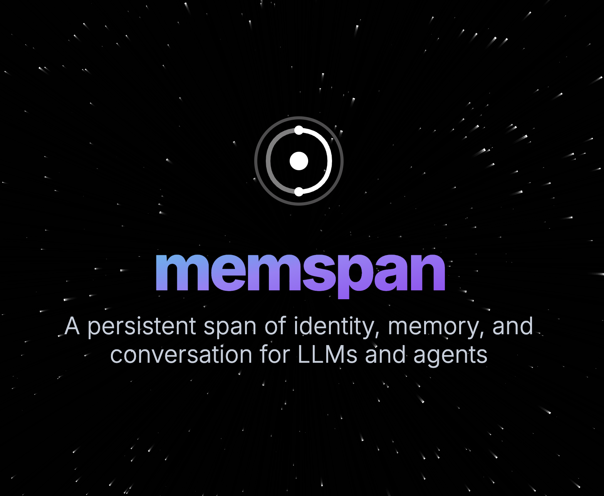
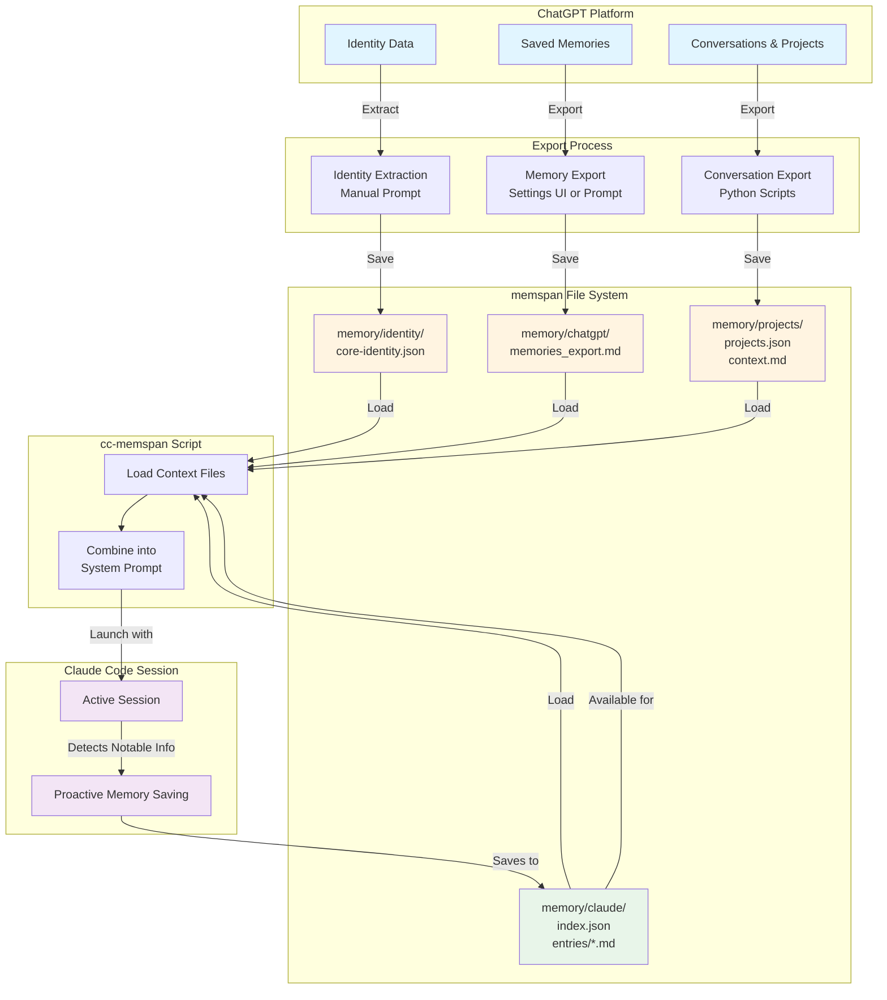

# Memspan.ai

<div align="center">
  
</div>


> A persistent span of identity, memory, and conversation for LLMs and agents

**Website:** [https://memspan.ai](https://memspan.ai)

**memspan** is a file-system based memory archive system that helps you extract, organize, and load your personal identity, saved memories, and conversation history into Claude Code and other LLM interfaces. It provides a portable, tool-agnostic approach to maintaining continuity across AI assistant sessions.

## Overview

Memspan addresses a fundamental challenge: **LLMs don't remember across sessions**. While platforms like ChatGPT offer memory features, they're platform-locked and don't easily transfer to other tools like Claude Code. memspan bridges this gap by:

- **Extracting** your identity, memories, and conversation history from platforms like OpenAI ChatGPT
- **Organizing** this data into a structured, portable format
- **Loading** it dynamically into Claude Code sessions when needed

The system is designed to be:
- **File-based**: No databases, no servers—just files you control
- **Portable**: Works across different LLM tools and platforms
- **Selective**: Load only what you need for each session
- **Independent**: Doesn't interfere with Claude Code's own memory system

## Current State

### What Works Today

memspan currently provides:

1. **Identity Extraction**: Scripts and prompts to extract your personal identity from ChatGPT conversations
2. **Memory Export**: Tools to export and structure ChatGPT saved memories
3. **Project Conversations**: Scripts to correlate ChatGPT Projects with conversation history (the default export doesn't include project metadata)
4. **Context Loading**: A wrapper script (`cc-memspan`) to dynamically load identity, memories, and project context into Claude Code sessions

### Architecture

The project follows a three-tier memory model:

1. **Core Identity** (~2-4KB): Always-available personal context
2. **Project/Framework Memory** (~10-50KB per domain): Session-selectable deep context
3. **Historical Archive**: Indexed, retrieved on-demand

### Memory Architecture



## Challenges & Limitations

### Data Extraction Challenges

There are **no automatic tools** to extract all this data. The process requires:

- **Manual prompting**: Using prompts to extract identity from conversations
- **Memory export**: Either through ChatGPT's memory UI or by prompting ChatGPT to export memories
- **Data correlation**: The default OpenAI data export doesn't include project metadata—you need separate scripts to correlate conversations with projects

### Current Limitations

- **No MCP servers**: This version uses file-based context loading, not custom MCP servers
- **No vector search**: No embeddings or semantic search—just file-based retrieval
- **No integration**: Doesn't integrate with other memory systems (though this is a possible near-term direction)
- **Manual process**: Requires manual steps to extract and organize data

## Quick Start

> **New to memspan?** Start with the **[Quick Start Guide](docs/QUICKSTART.md)** for a comprehensive walkthrough.

### 1. Extract Your Identity

Use the prompts in `identity-archive/` to extract your identity from ChatGPT conversations. This creates a structured identity file.

### 2. Export ChatGPT Memories

Follow the instructions in `export-chatgpt-memories/README.md` to export your ChatGPT memories. You can either:
- Copy from ChatGPT Settings → Memory
- Use the export prompt to generate structured exports

### 3. Correlate Project Conversations

To export your conversations (and optionally correlate with projects), use the scripts in `export-chatgpt-conversations/`:

```bash
# Export projects metadata (if you use ChatGPT Projects)
python3 export-chatgpt-conversations/chatgpt_projects_dump.py --curl-file curl.txt

# Correlate conversations with projects
python3 export-chatgpt-conversations/chatgpt_project_conversations.py export
```

### 4. Load Context in Claude Code

Use the `cc-memspan` wrapper to load context into Claude Code. Here are the recommended usage patterns:

**Minimal Load (Identity + Memories):**
```bash
# Core identity and memories - recommended starting point
bash claude-memory/bin/cc-memspan --identity --memories
```

**Lightweight Project Awareness:**
```bash
# Add projects index (lightweight - just project names/metadata)
# Requires projects.json from export-chatgpt-conversations
bash claude-memory/bin/cc-memspan --identity --memories --projects-index
```

**Full Project Context (Higher Token Usage):**
```bash
# Load specific project with full context (context.md, conversations.json)
# Use ad-hoc for long-running projects with essential ChatGPT conversations
bash claude-memory/bin/cc-memspan --project project-name
```

**Note:** Loading full project context (`--project`) includes conversation history and can significantly increase token usage. Use `--projects-index` for lightweight project awareness, and reserve `--project` for when you need deep context from specific long-running projects.

See [`claude-memory/README.md`](claude-memory/README.md) for detailed usage instructions.

### Using Make (Optional)

A `Makefile` is provided to simplify common tasks:

```bash
# Show all available commands
make help

# Check prerequisites and status
make check
make status

# Extract identity (shows instructions)
make identity-prompt

# Launch Claude with context
make context-identity
make context-full PROJECT=project-name

# Show and install shell aliases
make aliases-show
make aliases-install
```

See the `Makefile` for all available targets.

## Usage Examples

### Basic Session with Identity

```bash
# Load just your identity
bash claude-memory/bin/cc-memspan --identity
```

Claude will now know who you are, your preferences, and your communication style.

**Example:** After loading identity, you can ask "who am I?" and Claude will respond with a summary based on your identity context:

```
> who am I?

Based on the identity context loaded for this session, you are [Your Name]:
  
  Personal
  - [Age], born [Year] in [Location]
  - Currently based in [Location]
  
  Professional
  - [Professional identity]
  - [Companies/roles]
  
  Tech Stack
  - [Languages, frameworks, tools]
  
  Personality
  - [Personality traits, values]
  - [Work philosophy]
  
  Current Focus
  - [Active projects]
  
  This identity was loaded from memory/identity/core-identity.json.
```

### Project-Specific Work

```bash
# Load identity + memories + project context
bash claude-memory/bin/cc-memspan --full your_project_name
```

This loads everything Claude needs to work on a specific project with full context.

### Proactive Memory Saving

When you share notable information (goals, preferences, insights), Claude will proactively suggest saving it to your memory system:

```
> I have a goal of losing 10lbs next year

⏺ Good goal! That's a reasonable and achievable target - roughly 0.8-1 lb per month 
allows for sustainable progress without extreme measures.

Looking at your current profile, you already have a solid foundation with strength 
training 3x/week and cardio 2x/week. Weight loss would mainly come down to nutrition 
adjustments alongside your existing routine.

---
Would you like me to save this goal to your memories (memory/claude/)? Per your 
current settings, I'm in ask-first mode for memory saves.

> yes

⏺ Saved to memory/claude/entries/2025-12-15-weight-loss-goal.md
```

When you confirm, Claude:
1. Creates a new entry file in `memory/claude/entries/`
2. Adds the entry to `memory/claude/index.json` with metadata
3. Makes the memory available for future sessions

This works automatically—Claude recognizes goals, preferences, insights, and other notable information and offers to save them.

### Quick Questions

```bash
# No context—just ask a question
claude "What's the best way to structure a Python package?"
```

For generic questions, you don't need to load any context.

## How It Works

### Context Loading

The `cc-memspan` script:
1. Reads selected context files (identity, memories, projects)
2. Combines them into a system prompt
3. Launches Claude Code with `--append-system-prompt`

This means the context is sent with every message, so Claude has access to your identity and memories throughout the session.

### Memory Precedence

When information conflicts:
1. **Claude memories** (in `memory/claude/`) take precedence over ChatGPT memories
2. **Newer entries** take precedence over older entries
3. **Explicit corrections** take precedence over inferred information

### File Organization

- **Identity**: Condensed personal context (~2-4KB)
- **Memories**: Structured memories from ChatGPT and Claude sessions
- **Projects**: Project-specific context, decisions, and conversation history
- **Archive**: Historical conversations indexed for on-demand retrieval

## Documentation

- **[Quick Start Guide](docs/QUICKSTART.md)**: Get up and running with memspan in minutes
- **[Identity Archive README](identity-archive/README.md)**: How to extract identity from ChatGPT
- **[ChatGPT Memories README](export-chatgpt-memories/README.md)**: How to export and structure ChatGPT memories
- **[Conversation Export README](export-chatgpt-conversations/README.md)**: How to export conversations and correlate with projects
- **[Claude Memory README](claude-memory/README.md)**: Usage guide for the context loading system

## Future Directions

Potential enhancements (not yet implemented):

- **MCP Server**: Custom MCP server for on-demand memory retrieval (reduces token costs)
- **Vector Search**: Embeddings and semantic search over conversation history
- **Auto-extraction**: Automated memory extraction from conversations
- **Cross-platform Sync**: Sync memories between ChatGPT and Claude
- **Memory Summarization**: Automatic summarization of new conversations

These enhancements are planned for future releases as the system evolves.

## Contributing

Contributions and ideas are welcome! This is a personal project designed to be:
- **Portable**: Standard formats (JSON, Markdown) that work across platforms
- **Tool-agnostic**: Works with any LLM interface, not locked to specific vendors
- **Explicit**: User controls what gets loaded when—no hidden assumptions

### How to Contribute

- **Report Issues**: Found a bug or have a feature request? Open an issue on GitHub
- **Submit Pull Requests**: Improvements, bug fixes, or new features are welcome
- **Share Ideas**: Have suggestions for improving the system? We'd love to hear them
- **Documentation**: Help improve docs, add examples, or clarify instructions

This project is a work in progress. Your feedback and contributions help make memspan better for everyone.

## License

MIT License - see [LICENSE](LICENSE) file

## Version History

**0.1.0** - 2025-12-15 - Initial release
  - Identity extraction from ChatGPT conversations
  - ChatGPT memory export and structuring
  - Project conversation correlation and export
  - Context loading system (`cc-memspan`) for Claude Code
  - Proactive memory saving system for Claude sessions
  - File-based memory archive with portable formats
  - Example files and comprehensive documentation

## About

**Website:** [https://memspan.ai](https://memspan.ai)  
**Created by [Eric Blue](https://about.eric-blue.com)**

memspan is a file-system based memory archive system that helps you extract, organize, and load your personal identity, saved memories, and conversation history into Claude Code and other LLM interfaces. It provides a portable, tool-agnostic approach to maintaining continuity across AI assistant sessions.

This project addresses the challenge of platform-locked memory systems by providing a portable, user-controlled alternative that works across different LLM tools and platforms.

## Notes

- This system is independent of Claude Code's own memory features
- All context loading is opt-in—you choose what to load per session
- The `chatgpt-history/` directory contains personal data and is ignored in this documentation

